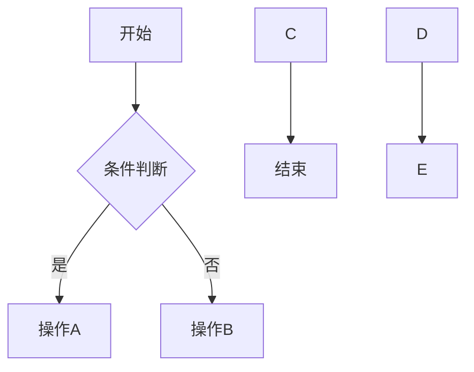
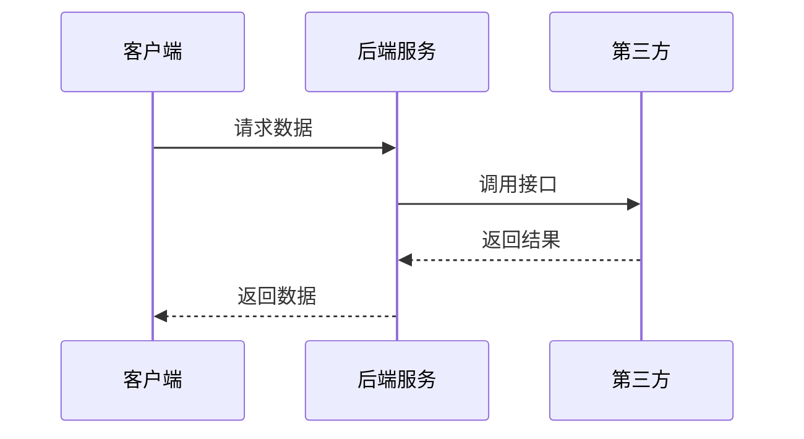

# \[需求名称]

## 📋 项目信息

|字段|内容|
|-|-|
|**产品名称**||
|**需求名称**||
|**文档负责人**||
|**所属模块**||
|**优先级**|P0 / P1 / P2|
|**预计上线日期**||
|**关联文档**|\[设计稿链接]() / \[数据看板]()|

\---

## 📝 版本记录

|日期|版本号|修改内容|修改人|
|-|-|-|-|
|YYYY-MM-DD|V1.0|初稿||
|||||

\---

## 📑 目录

1. [需求背景](#一需求背景)
2. [需求目标](#二需求目标)
3. [需求概述](#三需求概述)
4. [详细方案](#四详细方案)
5. [流程图（可选）](#五流程图可选)
6. [异常与边界处理](#六异常与边界处理)
7. [数据埋点](#七数据埋点)
8. [上线计划与灰度策略](#八上线计划与灰度策略)

\---

## 一、需求背景

### 1.1 现状问题

> 描述当前遇到的问题或痛点，用数据说话。
>
> 例如：当前课后作业提交率仅为60%，低于行业平均80%的水平。

### 1.2 业务目标

> 这个需求要达成什么业务目标？关键指标是什么？
>
> 例如：将课后作业提交率从60%提升至80%，预计带来续报率提升X%。

### 1.3 用户价值

> 对用户（学生/家长/老师）的价值是什么？

\---

## 二、需求目标

|目标类型|描述|衡量指标|目标值|
|-|-|-|-|
|核心目标||||
|次要目标||||

\---

## 三、需求概述

|序号|功能模块|功能点|优先级|面向端|状态|
|-|-|-|-|-|-|
|1|||P0/P1/P2|学生端/教师端/家长端|新增/修改|
|2||||||
|3||||||

\---

## 四、详细方案

### 4.1 \[功能点名称]

#### 交互设计

> 📸 \*\*在此插入设计稿/原型截图\*\*

#### 功能说明

1. **触发条件**: 描述该功能的触发时机
2. **展示规则**:

   * 规则1
   * 规则2
3. **交互逻辑**:

   * 用户操作A → 系统反馈B
   * 用户操作C → 系统反馈D
4. **状态变化**:

   * 默认状态：XXX
   * 触发后状态：XXX
   * 结束状态：XXX

> \[!IMPORTANT]
> ⚠️ 标注需要特别注意的关键变更或逻辑

\---

### 4.2 \[功能点名称]

#### 交互设计

> 📸 \*\*在此插入设计稿/原型截图\*\*

#### 功能说明

1. **触发条件**:
2. **展示规则**:
3. **交互逻辑**:
4. **状态变化**:

\---

*（按上述格式继续添加更多功能点...）*

\---

## 五、流程图（可选）

> 💡 \*\*本章节为可选章节\*\*，涉及多角色/多系统交互的需求建议补充，纯UI优化类需求可跳过。

### 5.1 业务流程图

> 描述用户视角的操作流程

### 5.2 系统时序图（如涉及多系统交互）

> 描述前后端、第三方系统之间的调用关系

\---

## 六、异常与边界处理

|序号|异常场景|处理方案|兜底策略|
|-|-|-|-|
|1|网络断连|||
|2|接口超时|||
|3|数据为空|||
|4|并发冲突|||

\---

## 七、数据埋点

|序号|埋点名|触发时机/交互|埋点位置|埋点类型|参数名|参数类型|参数值|备注|
|-|-|-|-|-|-|-|-|-|
|1|||展示/点击||courseId|int|课程ID||
||||||lessonId|string|课次ID||
||||||subId|int|学科ID||
||||||grade\_q||年级||
|2|||||||||

> \*\*通用参数说明\*\*（以下参数每个埋点默认携带，无需重复列出）：
> - `courseId`: 课程ID (int)
> - `lessonId`: 课次ID (string)
> - `subId`: 学科ID (int)
> - `grade\_q`: 年级

\---

## 八、上线计划与灰度策略

### 7.1 上线节奏

|阶段|时间|范围|关注指标|
|-|-|-|-|
|灰度1期||5%流量||
|灰度2期||50%流量||
|全量发布||100%||

### 7.2 回滚方案

> 描述出现问题时的回滚策略

\---

## 📎 附录

* \[设计稿地址]()
* \[技术方案文档]()
* \[测试用例]()
* \[数据看板]()

