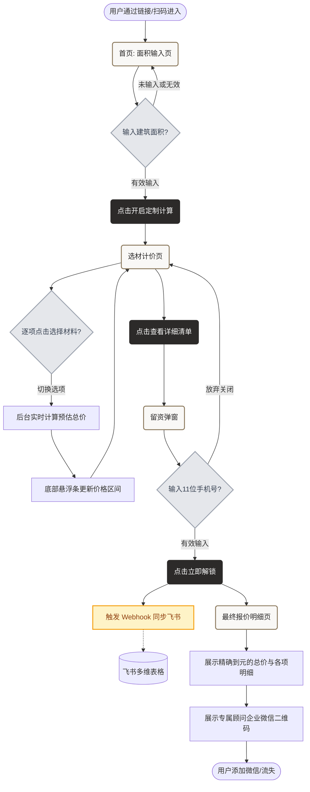

```mermaid
flowchart TD
    %% 样式定义
    classDef page fill:#f9f8f6,stroke:#8c7a5e,stroke-width:2px,color:#2c2a29
    classDef action fill:#2c2a29,stroke:#2c2a29,stroke-width:2px,color:#ffffff
    classDef condition fill:#e5e7eb,stroke:#9ca3af,stroke-width:2px,color:#374151
    classDef api fill:#fef3c7,stroke:#f59e0b,stroke-width:2px,color:#92400e
    
    %% 节点定义
    Start([用户通过链接/扫码进入]) --> Home(首页: 面积输入页):::page
    
    Home --> InputArea{输入建筑面积?}:::condition
    InputArea -- 未输入或无效 --> Home
    InputArea -- 有效输入 --> ClickStart(点击开启定制计算):::action
    
    ClickStart --> Selection(选材计价页):::page
    
    Selection --> SelectMaterial{逐项点击选择材料?}:::condition
    SelectMaterial -- 切换选项 --> CalcLogic[后台实时计算预估总价]
    CalcLogic --> UpdateUI[底部悬浮条更新价格区间]
    UpdateUI --> Selection
    
    Selection --> ClickDetail(点击查看详细清单):::action
    
    ClickDetail --> Modal(留资弹窗):::page
    
    Modal --> InputPhone{输入11位手机号?}:::condition
    InputPhone -- 放弃关闭 --> Selection
    InputPhone -- 有效输入 --> ClickUnlock(点击立即解锁):::action
    
    ClickUnlock --> SyncFeishu[触发 Webhook 同步飞书]:::api
    SyncFeishu -.-> Feishu[(飞书多维表格)]
    
    ClickUnlock --> Result(最终报价明细页):::page
    
    Result --> ShowDetail[展示精确到元的总价与各项明细]
    ShowDetail --> ShowQR[展示专属顾问企业微信二维码]
    
    ShowQR --> End([用户添加微信/流失])
```