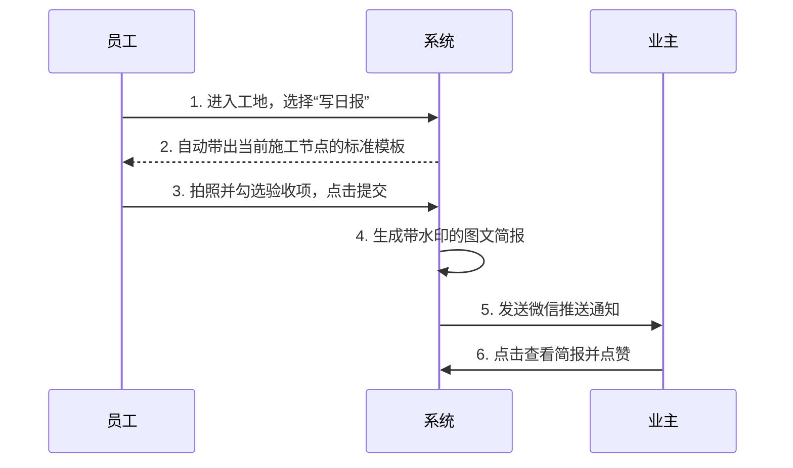

# [产品名称] 产品需求文档 (PRD)

> **💡 新手提示**：这是一份标准的 PRD 模板。在敏捷工作流中，这份文档是**逐步生成**的。
> 在原型设计完成前，你只需要关注前四部分（基本信息、背景、目标、场景）。原型确定后，再由 AI 帮你补充详细的交互说明。

*(页面右上角组件预留：版本切换下拉菜单 [v1.1 最新版 ▼] | [v1.0 历史版])*

---

## 📋 项目信息

| 字段 | 内容 |
|---|---|
| **产品名称** | [例如：筑家云记] |
| **版本定义** | [例如：v1.0 MVP (最小可行性产品)] |
| **文档负责人** | [你的名字] |
| **核心目标** | [一句话描述这个版本最想解决的问题] |
| **全局原型** | [放置全局原型链接或按钮] |

---

## 📝 版本记录

| 日期 | 版本号 | 修改内容 | 修改人 |
|---|---|---|---|
| YYYY-MM-DD | v1.0 | 需求方案定稿，补充交互细节 | [你的名字] |
| YYYY-MM-DD | v0.5 | 初稿，确立核心功能模块 | [你的名字] |

---

## 📑 目录

1. 需求背景
2. 需求目标
3. 用户与使用场景 (User Journey)
4. 需求功能清单
5. 详细方案 (带原型切片)
6. 业务流程图 (Mermaid)
7. 异常与边界处理
8. 数据追踪与埋点 (可选)
9. 未来演进规划 (Roadmap)
10. 附件 (数据字典/标准库)

---

## 一、需求背景

### 1.1 现状问题
> **💡 新手提示**：描述当前遇到的问题或痛点，最好能用数据说话，或者描述一个具体的糟糕场景。
> *例如：当前家装行业普遍存在“信息不透明”、“进度反馈滞后”、“业主焦虑感强”的痛点。*

### 1.2 为什么现在做？
> 描述做这个需求的紧迫性。

---

## 二、需求目标

| 目标类型 | 描述 | 衡量指标 | 目标值 |
|---|---|---|---|
| **核心业务目标** | 解决最大的痛点是什么？ | 例如：客服介入率 | 降低 50% |
| **用户体验目标** | 用户用完应该觉得怎么样？ | 例如：流程完成耗时 | 小于 1 分钟 |

---

## 三、用户与使用场景 (User Journey)

> **💡 新手提示**：这是非常重要的一环！在画原型前，先在脑海里像放电影一样过一遍用户是怎么用这个产品的。

**典型用户 1：[例如：项目经理 老王]**
- **场景描述**：老王每天要跑 3 个工地。他到达工地后，打开 App，选择对应的项目，点击“写日报”。系统自动帮他带出了今天应该检查的“水电节点”模板，他只需要拍几张照，勾选“合格”，点击发送，日报就自动发给业主了。
- **核心诉求**：操作要极度简单，不能打字太多，模板要自动匹配。

**典型用户 2：[例如：业主 小李]**
- **场景描述**：小李正在上班，突然收到微信推送。点开一看，是自己家水电做完的照片和验收合格的报告。他看完很放心，点了个赞，继续工作。
- **核心诉求**：不用去工地也能知道进度，能看到真实照片，有安全感。

---

## 四、需求功能清单

> **💡 新手提示**：先列骨架，不写细节。确认骨架没问题了，再去画原型。

### 4.1 [模块一名称，如：公共基础模块]
| 功能点 | 描述 | 优先级 |
|---|---|---|
| 身份选择 | 用户打开后选择“我是业主”或“我是员工” | P0 |

### 4.2 [模块二名称，如：管理工作台]
| 功能点 | 描述 | 优先级 |
|---|---|---|
| 结构化日报 | 选择节点自动匹配验收文案，支持现场拍照上传 | P0 |

---

## 五、详细方案 (带原型切片)

> **💡 新手提示**：这里是 PRD 的核心。左边是具体的交互规则，右边（或旁边）直接放做好的 HTML 原型切片（`iframe`），做到**“所见即所得”**。

### 5.1 [模块一名称]

| 模块 | 功能 | 详细规则与交互逻辑 | 原型演示 (沙盒切片) |
|---|---|---|---|
| **公共基础** | **身份验证** | **1. 触发条件** 用户首次打开系统时展示。  **2. 页面元素** - “我是业主”入口 - “我是管理者”入口  **3. 交互逻辑** - 点击“我是业主”，跳转至邀请码输入页。 - 点击“我是管理者”，跳转至员工登录页。  **4. 异常处理** - 邀请码输入错误超过 3 次，锁定 5 分钟。 | `<iframe src="./prototype.html#login" style="width:300px; height:600px; border:none;"></iframe>` |
| **员工端** | **写日报** | **1. 触发条件** ... **2. 交互逻辑** ... | `<iframe src="./prototype.html#write-report" style="width:300px; height:600px; border:none;"></iframe>` |

---

## 六、业务流程图 (Mermaid)

> **💡 新手提示**：在原型跑通后，用流程图把核心逻辑串起来。

---

## 七、异常与边界处理

> **💡 新手提示**：产品经理的价值往往体现在对异常情况的考虑上。

| 异常场景 | 系统如何处理 / 提示文案 |
|---|---|
| **网络断开** | 提示：“当前网络不佳，已为您保存草稿，请恢复网络后重试。” |
| **无权限访问** | 提示：“您暂无该工地的查看权限，请联系项目经理索要邀请码。” |
| **数据为空 (Empty State)** | 页面居中展示插画，文案：“暂无项目，快去新建一个工地吧~” + [新建工地] 按钮 |

---

## 八、数据追踪与埋点 (可选)

| 埋点位置 | 触发时机 | 追踪指标 | 目的 |
|---|---|---|---|
| 日报提交页 | 点击“确认提交”按钮 | 提交成功率、平均停留时长 | 评估写日报功能是否足够提效 |

---

## 九、未来演进规划 (Roadmap)

> **💡 新手提示**：不要试图在一个版本里做完所有事。把那些“以后可以做，但现在不急”的想法放在这里。

- **v1.0 (当前)**：跑通核心的日报上报与进度查看流程。
- **v1.5**：加入“主材库”对接，支持一键呼叫材料商送货。
- **v2.0**：加入数据看板，给老板看所有工地的延期率、投诉率。

---

## 十、附件

* [业务数据字典（工序与主材）]
* [工艺做法与验收标准库]